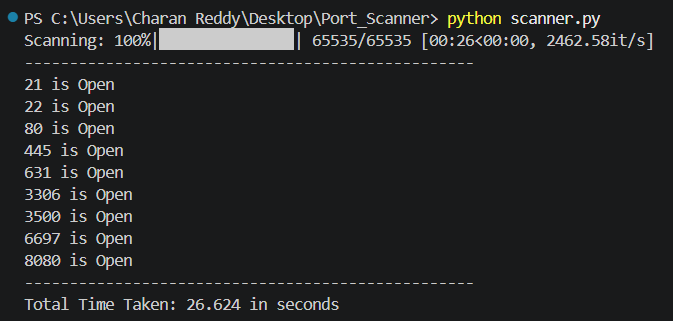
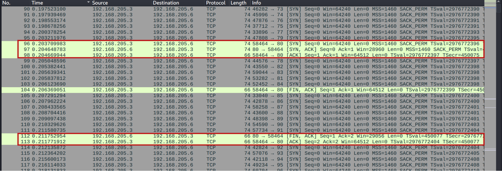

# Multi-threaded Port Scanner (Python)

This is a fast, multi-threaded **TCP port scanner** written in Python. It scans a target IP address across a specified port range and identifies open ports using socket connections.

---

## Demo

### 🔹 Terminal Output


---
##  Features

- Multi-threaded scanning for high speed ⚡  
- Scans full port range (0–65535)  
- Uses queue-based task distribution  
- Displays real-time progress using `tqdm`  
- Thread-safe result collection  
- Measures total scan time  

---

##  Requirements

Make sure you have Python 3 installed along with the required library:

```bash
pip install tqdm
```

---

## Usage

- Clone or download the script.
- Modify the target IP address inside the script:

```python 
ip = "192.168.205.6"
```

- Run the script:

```bash
python scanner.py
```

--- 

## Configuration
You can customize the following parameters:


```python 
ip = "192.168.205.6"   # Target IP address
start_range = 0        # Starting port
end_range = 65535      # Ending port
num_threading = 500    # Number of threads
```

### Notes:
- Increasing threads speeds up scanning but uses more system resources.
- Timeout is set to 0.3 seconds per connection.

---

## How It Works
- All ports are added to a queue.
- Multiple threads pick ports from the queue.
- Each thread:
    - Creats a socket 
    - Attempts to connect to the port
    - Marks it as open if successful
- Progress is tracked using a progress bar.
- Result are stores safely using a thread lock.

###  Wireshark Analysis (Port 80)

Packets 96–98 show a successful TCP 3-way handshake, confirming port 80 is open.  
Packets 112–113 show the connection being properly closed.



--- 

## output Example

```bash
Scanning: 100%|███████████████| 65535/65535 [00:39<00:00, 1642.80it/s]
--------------------------------------------------
22 is Open
80 is Open
443 is Open
--------------------------------------------------
Total Time Taken: 12.345 seconds
```
---

## Disclaimer

This tool is intended for educational and authorized testing purposes only.
- Do NOT scan systems without permission.
- Unauthorized scanning may be illegal in your country.

--- 

## Future Improvements

- Add UDP scanning
- Save results to a file
- Add banner grabbing
- Support for domain names
- Adjustable timeout via CLI

--- 

### Author

Charan Reddy Muli